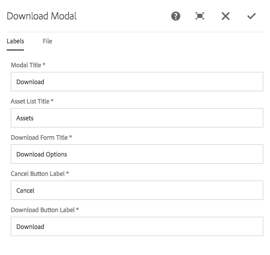
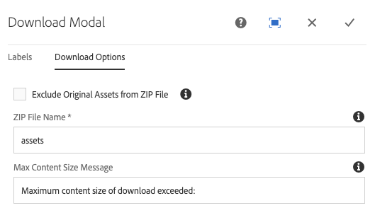
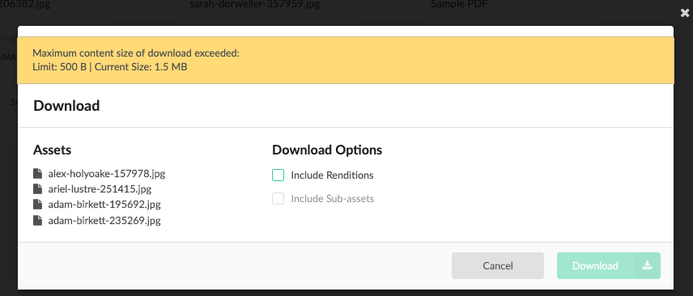

> For Asset Share Commons 2.x see [Download Modal](../)
>
> The Download Modal action has change significantly in Asset Share Commons 2.x.


Displays the modal used to download one or more assets.

* The left portion of the modal displays the list (one or more) assets that will be downloaded as part of this operation.
    * Multiple assets can be downloaded via the [Cart](../cart/). 
* The original assets is included in the download zip via the **Exclude Original Assets from ZIP File** dialog configuration.
* Users can select to include all renditions.
* Users can select to include all (any) sub-assets.

The resulting download is a zip file (the zip file name can be authored via the dialog).

## Authoring

The Download Modal is authored by opening up the download action page (of Action Template type) via AEM's Site admin. 

*Each download page should have exactly one Download Modal component.*

This Download Modal action page must referenced from the [Search page's Page Properties](../search/#page-properties). 


The modal displays the placeholder image when being authored.

### Dialog / Labels



#### Modal Title

The modal's title.

#### Asset List Title

The title text to display above the list of assets to download.

#### Download Form Title

The title text to display above the download option check-boxes.

#### Cancel Button Label

The text for the button that closes the modal.

#### Download Button Label

The text for the button that lets users download the assets.

### Dialog / File



#### Exclude Original Assets from ZIP File (since v1.2.0)
 
Check to exclude original assets from the downloaded zip file. This applies for all uses of this Download modal.

#### ZIP File Name
 
The name of the zip file to download.

#### Max Content Size Message

The message displayed to a user if the potential download size exceeds the maximum size limit of the Asset Download Servlet.

## Download Size Limit (since v1.8.0)



A UI warning will be presented to the user if the potential size of the download exceeds the max content size limit of the Asset Download Servlet and the download button will be disabled. The UI warning errors on the side of caution when calculating the potential download size and assumes the user will include Renditions and sub assets. More information about the Asset Download Servlet can be found below.

## Technical details

* **Component**: `/apps/asset-share-commons/components/modals/download`
* **Sling Model**: `N/A`

The download functionality leverages AEM Assets `AssetDownloadServlet` servlet. To ensure this servlet is
available, the following request path must be open (ie. not blocked via AEM Dispatcher filters).

    HTTP POST /content/dam.assetdownload.zip/<ZIP File Name>.zip?licenseCheck=true&flatStructure=true&downloadSubassets=<true|false>&downloadRenditions=<true|false>

An ajax POST call is triggered to load the Download modal. The POST method is used to avoid a lengthy URI request calls with multiple asset path parameters. The [ActionPageServlet](https://github.com/Adobe-Marketing-Cloud/asset-share-commons/blob/master/core/src/main/java/com/adobe/aem/commons/assetshare/components/actions/impl/ActionPageServlet.java) is used to load the modal.

### Enable AssetDownloadServlet

Starting in AEM 6.5 the `AssetDownloadServlet` is disabled by default in Publish instances.

Asset Share Commons enables the `AssetDownloadServlet` on publish instances and sets a maximum download size of **1 GB**. It is recommended to set a max size as low as possible without affecting the day-to-day download requirements. A high value may impact performance.

### Update maxcontentsize for the AssetDownloadServlet

If you wish to change the default max size limit from **1GB** to a different value in production:

1. Create a folder with a naming convention that targets the **publish** and **nosamplecontent** run modes, i.e: `/apps/<your-app-name>/config.publish.nosamplecontent`
  
  > Note* you can use another runmode to target, it just needs to be more specific than **config.publish** in order to override the configuration created by Asset Share Commons

2. Create a new OSGi Configuration named `com.day.cq.dam.core.impl.servlet.AssetDownloadServlet` in the `config.publish.nosamplecontent` folder.

3. Populate the `AssetDownloadServlet` config with the following (represented in XML) changing the value of `asset.download.prezip.maxcontentsize`:

    ```xml
    <?xml version="1.0" encoding="UTF-8"?>
    <jcr:root xmlns:sling="http://sling.apache.org/jcr/sling/1.0" xmlns:jcr="http://www.jcp.org/jcr/1.0"
      jcr:primaryType="sling:OsgiConfig"
      asset.download.prezip.maxcontentsize="{Long}YOURVALUE"
      enabled="{Boolean}true"/>
    ```

  > *Note `maxcontentsize` is set in bytes

### Additional Documentation

* [Enable Asset Download Servlet](https://helpx.adobe.com/experience-manager/6-5/assets/using/download-assets-from-aem.html#EnableAssetDownloadServlet)
* [Security Checklist - Mitigate Denial of Service (DoS) Attacks](https://helpx.adobe.com/experience-manager/6-5/sites/administering/using/security-checklist.html#FurtherReadings)