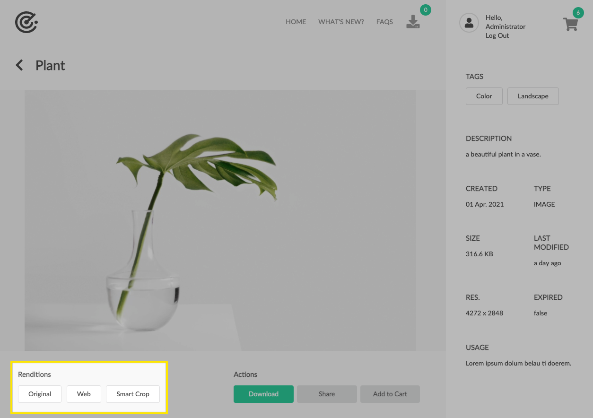
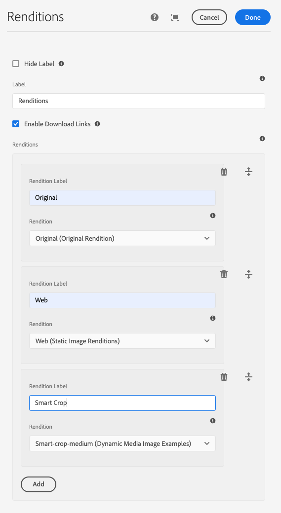

Displays a series of labels representing renditions available or unavailable for a given asset.

## Authoring

Only renditions configured in the dialog will be evaluated for display.

### Dialog / Configuration

#### Hide Label

Select to hide the label.

#### Label

The label for the component.

#### Enable Download Links

Selecting will turn the rendition labels into links allowing end users to directly download individual renditions. If the asset requires a license agreement prior to download the rendition labels will render without links, even with this selected.

#### Show Missing Renditions

By default missing renditions for an asset are not displayed. Selecting will show a disabled rendition label for the missing rendition.

#### Renditions

Determines the renditions evaluated for display. 

* Rendition Label : The label to display to the user.
* Rendition File Name Regex : A regular expression [pattern](https://docs.oracle.com/javase/8/docs/api/java/util/regex/Pattern.html) used to map a rendition file name to the rendition label. Renditions are looked for beneath the `renditions` folder located beneath `<dam:asset>/jcr:content/renditions`. If multiple renditions match the regular expression, then multiple renditions will appear with the same label.

## Technical details

* **Component**: `/apps/asset-share-commons/components/details/renditions`
* **Sling Model**: `com.adobe.aem.commons.assetshare.components.details.impl.RenditionsImpl`

This component allows authors to enter a regular expression pattern. The [java.util.regex.Pattern](https://docs.oracle.com/javase/8/docs/api/java/util/regex/Pattern.html) class is used. If an improper regular expression is inputted an exception will be thrown.