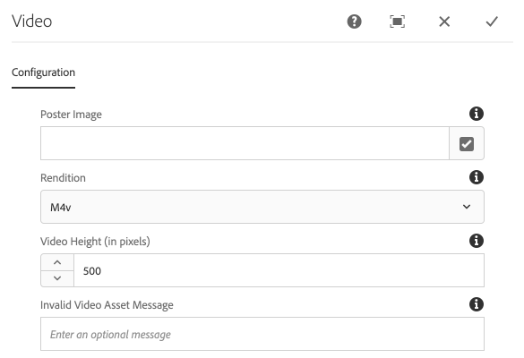

The Video component displays an video preview for a given Asset.

This component should ONLY be placed on an asset details page that is selected to play  video assets.

## Authoring

Authors have several configurations available to choose which asset rendition is displayed.

### Dialog / Configuration

#### Poster Image

An Image asset to display prior to the video loading / being played.

#### Rendition

A Video rendition that can be picked from a dropdown that lists all Asset Rendition Names that are registered to Asset Rendition Dispatcher OSGi configurations with `type = video`. These values are exposed via [Asset Share Commons' Asset Rendition framework](/asset-share-commons/pages/development/asset-renditions/).

OOTB the available image renditions are available:

* Original (maps to static original rendition)
* Mp4 (maps to the static *.mp4)
* M4v (maps to the static *.m4v)

#### Video Height (in pixels)

The maximum height of the video player in pixels. Leave blank for no maximum height.

#### Invalid Video Asset Message

The message to display if a non-video asset is attempted to be displayed by this component.

### Legacy support

In Asset Share Commons v1.8.0 the dialog was updated to use the Renditions provided by the [Asset Share Commons' Asset Rendition framework](/asset-share-commons/pages/development/asset-renditions/).

Previous instances of Video components will continue to work and allow configurations in both modes using a Legacy Mode toggle switch.

Any NEW instance of the Video component ONLY supports the Asset Renditions.

#### Migrating off legacy

It is highly recommended to move to the new Asset Rendition based approached at your earliest convenience. The easiest way to migrate is to:

1. Define and configure any required AssetRenditionDispatcher configurations, and promote through QA -> Stage as needed.
2. Update AEM Dispatcher configuration to support Asset Renditions.
3. Deploy Asset Share Commons v1.8.0+ and any dependency configurations to production environment.
3. On AEM Author, navigate to the page with the Video component.
4. Enter Edit mode
5. Add a NEW Video component above the Video component using the legacy configuration.
6. Configure the NEW Video component as needed, and verify it is surfacing the expected rendition.
7. Delete the previous Video component using the legacy configuration.
8. Double-check everything works as expected on AEM Author.
9. Publish the page.
10. Double-check the page renders properly on AEM Publish
11. Rinse, repeat for all instances of the Video component.

## Technical details

* **Component**: `/apps/asset-share-commons/components/details/video`
* **Sling Model**: `com.adobe.aem.commons.assetshare.components.details.impl.VideoImpl`

**Dialog Data Sources**

* **Renditions**: [`com.adobe.aem.commons.assetshare.content.impl.datasources.AssetRenditionsDataSource`](https://github.com/Adobe-Marketing-Cloud/asset-share-commons/blob/develop/core/src/main/java/com/adobe/aem/commons/assetshare/content/impl/datasources/AssetRenditionsDataSource.java) with a filter of `allowedAssetRenditionTypes="[video]"`
