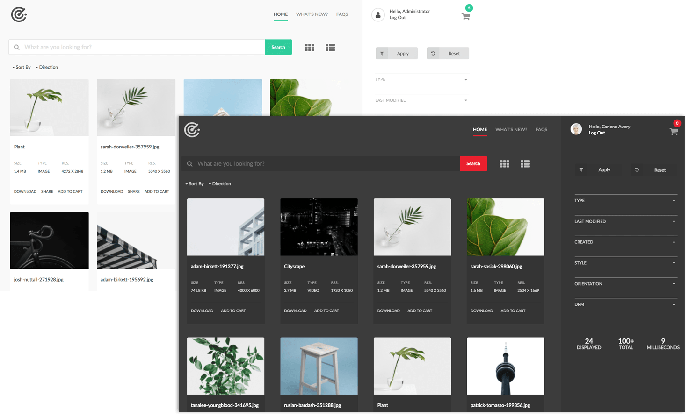
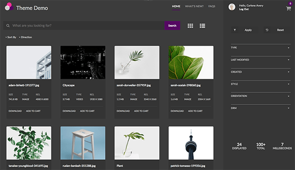
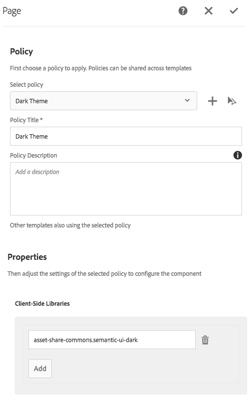

Asset Share Commons ships with two themes **Light** and **Dark**.

After installing the `ui.content` package to a local AEM instance
  * the Light theme can be viewed at [http://localhost:4502/editor.html/content/asset-share-commons/en/light.html](http://localhost:4502/editor.html/content/asset-share-commons/en/light.html) 
  * and the Dark theme can be viewed at [http://localhost:4502/editor.html/content/asset-share-commons/en/dark.html](http://localhost:4502/editor.html/content/asset-share-commons/en/dark.html)

## Introduction to Theming Video




A short video introduction to theming in [Asset Share Commons can be viewed here.](https://helpx.adobe.com/experience-manager/kt/assets/using/asset-share-commons-article-understand/asset-share-commons-feature-video-theming.html)

## Templates



The client libraries for each theme are included in the page via the Page Design of an editable template. Asset Share Commons templates can be viewed on a localhost [here.](http://localhost:4502/libs/wcm/core/content/sites/templates.html/conf/asset-share-commons) 

* Dark Theme ClientLib: `asset-share-commons.semantic-ui-dark`
* Light Theme ClientLib: `asset-share-commons.semantic-ui-light`

## Semantic UI

[Semantic UI](https://semantic-ui.com/) web framework is used for most front-end UI elements in Asset Share Commons. The [LESS only distribution](https://semantic-ui.com/introduction/advanced-usage.html#less-only-distribution) of Semantic UI has been ported into AEM as several client libraries. The theming in Asset Share Commons is heavily based on [theming](https://semantic-ui.com/usage/theming.html) in Semantic UI.

## Theme Client Library Structure

Below is the client library structure for the asset-share-commons.semantic-ui-light.

```
</apps/asset-share-commons/clientlibs/clientlib-theme>

  /semanticui-light
    /assets (fonts and images included here)
    /definitions (Semantic UI LESS distribution, files should NEVER be modified here)
        /behaviors
        /collections
        /elements
        /globals
        /modules
        /views
    /themes
        /default (default Semantic UI theme)
        /light   (Asset Share Commons theme, files beneath this directory are intended to be modified) 
            /collections
            /elements
            /globals
                + theme.variables (color scheme variables, override these first)
                + site.variables  (full site variables, includes theme.variables at bottom of file)
            /modules
            /views
    + theme.config (configuration for which theme to use per element)
    + theme.less   (overlays custom variables to override default styles)
    
```

Each LESS file beneath the definition folder goes through the following resolution before the final CSS is compiled. For example:

**menu.less** (../semanticui-light/definitions/collections/menu.less)

1. Default Theme Site Variables `../themes/default/globals/site.variables`
2. Light Theme Site Variables `../themes/light/globals/site.variables + theme.variables`
3. Default Element Variables `../themes/default/collections/menu.variables`
4. Light Element Variables `../themes/light/collections.menu.variables`
5. **menu.less** `actual less file`
6. Default Element Overrides `../themes/default/collections/menu.overrides`
7. Light Element Overrides `../themes/light/collections.menu.overrides`

As a best practice `.variables` files should be changed in the custom theme folder (in the above case `light`) to override style attributes. Only if an additional style is required should the *.overrides* file be used/modified. Due to the nature of LESS compiliation in AEM a *.variables* and a *.overrides* file is required each time an element needs to be changed by the theme (even if these files are empty). 

[More information about theming in Semantic UI.](https://semantic-ui.com/usage/theming.html#definition-file). 
