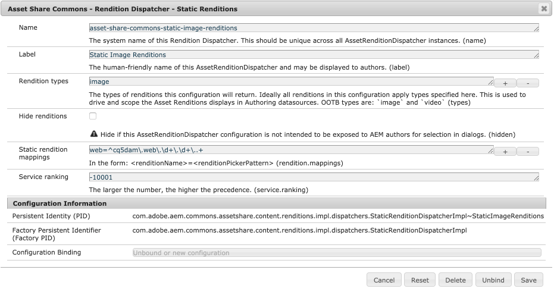

Asset Share Commons v1.8.0+ includes a cache-able Asset Rendition delivery framework. This allows specific Assets Renditions to be requested via URL.
This frameworks solves two problems:

1. It allows cache-able (at AEM Dispatcher) renditions, as previously cache collisions would occur between requests for:
`/content/dam/images/dog.png` and `/content/dam/images/dog.png/_jcr_content/renditions/cq5dam.xxx.xxx.xxx.png`, since in AEM Dispatcher's file system cache, the item at `/content/dam/images/dog.png` would be either a file or a folder, depending on which HTTP request was cached first.

2. It provides an abstraction between the "public" rendition URL, and the actual rendition in AEM (which is ~ an implementation detail).
For example, today the "web" rendition may be `/content/dam/images/dog.png/_jcr_content/renditions/cq5dam.web.1280.1280.png`, but tomorrow it me be updated to a higher resolution at `/content/dam/images/dog.png/_jcr_content/renditions/cq5dam.web.1600.1600.png`.
Ideally the change of what it means to be the "web rendition" happens once internally, and all clients that need the web rendition can remain ignorant of this backend change.


The Asset Rendition framework is an extensible framework that maps simple URLs to back-end processes, which are responsible for serving up the appropriate rendition.

HTTP GETs are made to Asset resources in the following format:

   `HTTP GET <absolute asset path>.renditions/<rendition name>/download/asset.rendition`

The `download` suffix segment is optional, and when set will mark the response to be downloaded as an attachment via the `Content-Disposition` HTTP response header.

For example:

    HTTP GET /content/dam/images/dog.renditions/web/download/asset.rendition

    HTTP GET /content/dam/asset-share-commons/en/public/pictures/lilly-rum-250927.jpg.renditions/web/asset.rendition


## Defining Asset Renditions

The way this works is **AssetRenditionDispatcher** implementations (OSGi configuration factories) are created that map "names" to renditions.
Asset Share Commons provides 2 implementations described below, however custom implementations can be created.

When an HTTP request is made to the `AssetRenditionServlet`, by requesting a `dam:Asset` with the `.renditions` extension,
it resolves the first suffix segment (which is specified the "rendition name") to an accepting `AssetRenditionDispatcher`
implementation and calls its `dispatch(..)` method, which can handle the request/response any way it likes (including a 301/302 redirect)

There are 2 provided `AssetRenditionDispatcher` configuration factory implementations:

*Note that the OSGi configurations should be placed in `/apps/xxx/config` rather than an author or publish run-mode specific folder, as they need to be available on both AEM Author and AEM Publish.

### Static Rendition Dispatchers

`StaticRenditionDispatcherImpl` streams the matching static rendition (`[dam:Asset]/jcr:content/renditions/*`) to the response.


| Label       | OSGi property | Description   |
|-------------|---------------|---------------|
| Name        | name          | The system name of this Rendition Dispatcher. This should be unique across all AssetRenditionDispatcher instances. This can be used to exclude all rendition mappings from uses of the Asset Renditions DataSource.
| Label       | label         | The human-friendly name of this AssetRenditionDispatcher and may be displayed to authors. |
| Rendition types | types     | The types of renditions this configuration will return. Ideally all renditions in this configuration apply types specified here. This is used to drive and scope the Asset Renditions displays in Authoring datasources. OOTB types are: `image` and `video` |
| Hide renditions | hidden | Hide if this AssetRenditionDispatcher configuration is not intended to be exposed to AEM authors for selection in dialogs. |
| Static rendition mappings	| rendition.mappings | In the form: `<renditionName>=<renditionPickerPattern>` |
| Service ranking | service.ranking | Higher service rankings take precedence.


**Static rendition mappings** are multi-value fields in the form:

    <rendition-name>=<static rendition node-name pattern>
     original=original
     web=cq5dam\.web\..+
     pdf=custom-print-rendition.pdf

#### Example OSGi factory configuration



#### Example sling:OsgiConfig definition

    <jcr:root xmlns:sling="http://sling.apache.org/jcr/sling/1.0" xmlns:jcr="http://www.jcp.org/jcr/1.0"
              jcr:primaryType="sling:OsgiConfig"
              service.ranking="-10001"
              label="Static Image Renditions"
              name="asset-share-commons-static-image-renditions"
              types="[image]"
              rendition.mappings="[web=^cq5dam\\.web\\.\\d+\\.\\d+\\..+]"
    />

Review the example XML definition at [com.adobe.aem.commons.assetshare.content.renditions.impl.dispatchers.StaticRenditionDispatcherImpl-StaticImageRenditions.xml](https://github.com/Adobe-Marketing-Cloud/asset-share-commons/blob/develop/ui.apps/src/main/content/jcr_root/apps/asset-share-commons/config/com.adobe.aem.commons.assetshare.content.renditions.impl.dispatchers.StaticRenditionDispatcherImpl-StaticImageRenditions.xml)

### Internal Redirect Renditions

`InternalRedirectRenditionDispatcherImpl` performs an internal Sling-Forward to a newly constructed URL - the common use case is to invoke the OOTB thumbnail servlet or ACS Commons Named Image Transform.

| Label       | OSGi property | Description   |
|-------------|---------------|---------------|
| Name        | name          | The system name of this Rendition Dispatcher. This should be unique across all AssetRenditionDispatcher instances. This can be used to exclude all rendition mappings from uses of the Asset Renditions DataSource.
| Label       | label         | The human-friendly name of this AssetRenditionDispatcher and may be displayed to authors. |
| Rendition types | types     | The types of renditions this configuration will return. Ideally all renditions in this configuration apply types specified here. This is used to drive and scope the Asset Renditions displays in Authoring datasources. OOTB types are: `image` and `video` |
| Hide renditions | hidden | Hide if this AssetRenditionDispatcher configuration is not intended to be exposed to AEM authors for selection in dialogs. |
| Rendition mappings	| rendition.mappings | In the form: `<renditionName>=<internal url>` |
| Service ranking | service.ranking | Higher service rankings take precedence.


*Rendition Mappings* are multi-value fields in the form:

    <rendition-name>=<internal url>
    placeholder=/content/dam/placeholder.jpg
    card=${asset.path}.thumb.320.320.jpg
    list=${asset.path}.thumb.100.100.jpg
    hero=${asset.path}.thumb.2400.2400.${asset.extension}

Supported "variables" in the `rendition.types` field are as follows:
* `${asset.path}` = the asset's full, absolute path
* `${asset.name}` = the asset's node name
* `${asset.extension}` = the asset's extension (derived from the node name)
* `${rendition.name}` = the rendition name provided as the key for the matched expression

#### Example OSGi factory configuration


#### Example sling:OsgiConfig definition

    <jcr:root xmlns:sling="http://sling.apache.org/jcr/sling/1.0" xmlns:jcr="http://www.jcp.org/jcr/1.0"
              jcr:primaryType="sling:OsgiConfig"
              service.ranking="-9001"
              label="Search Results"
              name="asset-share-commons-search-results"
              hidden="{Boolean}true"
              rendition.mappings="[card=${asset.path}.thumb.319.319.jpg,list=${asset.path}.thumb.140.140.jpg]"
    />

Review the example XML definition at [com.adobe.aem.commons.assetshare.content.renditions.impl.dispatchers.InternalRedirectRenditionDispatcherImpl-SearchResults.xml](https://github.com/Adobe-Marketing-Cloud/asset-share-commons/blob/develop/ui.apps/src/main/content/jcr_root/apps/asset-share-commons/config/com.adobe.aem.commons.assetshare.content.renditions.impl.dispatchers.InternalRedirectRenditionDispatcherImpl-SearchResults.xml)


## Provided Asset Rendition Dispatcher Configurations


| Type                         | Name                                        | Service ranking | Label                   | Rendition types | Hidden | Rendition mappings                                                            |
|------------------------------|---------------------------------------------|-----------------|-------------------------|-----------------|--------|-------------------------------------------------------------------------------|
| Internal Redirect            | asset-share-commons-search-results          | -9001           | Search Results          |                 | Yes    | card=${asset.path}.thumb.319.319.jpg<br/>list=${asset.path}.thumb.140.140.jpg |
| Static Renditions            | asset-share-commons-static-image-renditions | -10001          | Static Image Renditions | image           | No     | web=^cq5dam\.web\.\d+\.\d+\..+
| Static Renditions            | asset-share-commons-static-video-renditions | -20001          | Static Video Renditions | video           | No     | m4v=^cq5dam\.video\..+\.m4v<br/>mp4=^cq5dam\.video\..+\.mp4
| Static Renditions            | asset-share-commons-original-renditions     | -100001          | Original Rendition      |                | No     | original=^original$

*Note when the "Rendition Types" is empty, this implicitly means "all".*


### Overriding provided Asset Rendition configurations

Since Asset Share Commons installs the above configurations they cannot be removed, however they can be overridden. For example, if a different "web" rendition is desired the implementor can create a new OSGi configuration (of any type), and set the `Service ranking` to be greater than zero.
The Rendition Name whose config has the highest service ranking will be used.


## Dispatcher configuration

In order to configure AEM Dispatcher to handle Asset Rendition URLs gracefully, two adjustment need to be made:

1. Add an `allow` filter to AEM Dispatcher that allows the `.renditions` extension.


```
/10000 {
    /type "allow"
    /method "GET"
    /path "/content/dam"
    /extension '(renditions)'
}
```

2. Configure AEM Dispatcher to cache (at least) the following HTTP response headers set by the Asset Renditions framework.


```
/headers {
    ...
    "Content-Disposition"
    "Content-Type"
    "Content-Length"
    ...
}
```


## Asset Renditions DataSource

Available Asset Renditions can be exposed in Dialogs for author selection via the use of a Granite UI datasource, using the `sling:resourceType` of `asset-share-commons/data-sources/asset-renditions`, for example:

     <asset-rendition
            jcr:primaryType="nt:unstructured"
            sling:resourceType="granite/ui/components/coral/foundation/form/select"
            emptyText="Select an asset rendition to display"
            fieldDescription="Select the rendition to use."
            fieldLabel="Rendition"
            excludeAssetRenditions="[original]
            allowedAssetRenditionTypes="[image]"
            name="./renditionName">
        <datasource
                jcr:primaryType="nt:unstructured"
                sling:resourceType="asset-share-commons/data-sources/asset-renditions"/>
    </asset-rendition>

The Asset Renditions names can be controlled via the following mechanisms:

#### Globally hide rendition names for any data source via OSGi configuration

* Any Asset Rendition Dispatcher OSGi configurations with the OSGi property `hidden` set to `true` will never provided any asset renditions to the data source.
    * Note that the Asset Share Commons Asset Rendition configuration for Search Results, which define Asset Renditions for `card` and `list` are marked as hidden using this technique to prevent them from showing up in any drop-downs.

#### Per dialog widget

* `excludeAssetRenditions` exclude any Renditions Names who match any value in this list.
   * The Rendition Names are derived from the first segment of the `rendition.mappings` (`<rendition name>=<target>`)
* `excludeAssetRenditionDispatchers` excludes all Rendition Names from Asset Rendition Dispatchers
    * The matching is against the Asset Rendition Dispatcher OSGi factory configuration property `name` (ex. asset-share-commons-static-images, asset-share-commons-search-results, my-custom-image-renditions)
* `allowedAssetRenditionTypes` includes only the Rendition Names from Asset Rendition Dispatches, who have been registered with a type that matches at least one entry in this list.
    * The matching is against the Asset Rendition Dispatcher OSGi factory configuration property `types` (ex. image, video, my-custom-asset-type).
    * This is often helpful since its difficult for a single component to be able to rendition every possible rendition type: image, video, audio, document, etc. This allows different AEM components to target different fundamentally distinct asset types.

Example use of the DataSource in the [Details - Image component dialog](https://github.com/Adobe-Marketing-Cloud/asset-share-commons/blob/develop/ui.apps/src/main/content/jcr_root/apps/asset-share-commons/components/details/image/_cq_dialog/.content.xml).

[AssetRenditionsDataSource source code](https://github.com/Adobe-Marketing-Cloud/asset-share-commons/blob/develop/core/src/main/java/com/adobe/aem/commons/assetshare/content/impl/datasources/AssetRenditionsDataSource.java)

## Developing custom AssetRenditionDispatchers

1. Review the [provided AssetRenditionDispatchers](https://github.com/Adobe-Marketing-Cloud/asset-share-commons/tree/develop/core/src/main/java/com/adobe/aem/commons/assetshare/content/renditions/impl/dispatchers).
2. Create a new OSGi service that implements the `AssetRenditionDispatcher` interface.
3. Bulk of custom logic will be in the `dispatch(..)` method; Other methods can mostly be copied from examples in Step 1.
4. Make sure to assign the correct (higher) `service.ranking` to supersede any Asset Share Commons provided Rendition Names.
5. Make sure to assign the correct `types` (image or video) to if the Rendition Names should show in the OOTB components.


