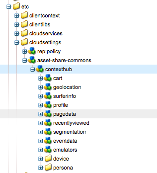

## v1.2.2 release notes

### Fixed
- 0123: Fixed issued with OOTB ContextHub store type nodes not installing.

## Important upgrade considerations

### ContextHub store nodes
After this installation, your `/etc/cloudsettings/asset-share-commons/contexthub` should have the following nodes:



### Dispatcher considerations for user menu

The user menu has changed to use ContextHub to manage the anonymous vs authenticated state in the user menu component.

* Ensure the ContextHub is set on the Asset Share root page to `/etc/cloudsettings/asset-share-commons/contexthub`
* It maybe necessary to clear the browser cache to reload changed JavaScript.
* An AJAX HTTP GET is made to `/libs/granite/security/currentuser.json?nocache=<time-in-ms>` on page loads to retrieve the current user. This URI must be allowed via AEM Dispatcher.  
* An AJAX HTTP GET is made to `/home/users/.../<user>.infinity.json` on page loads to retrieve the current user. This URI must be allowed via AEM Dispatcher. This is a standard request made by the OOTB ContextHub Profile store.

### Custom theme ClientLibs update

If you have created your own theme based off the Asset Share Commons Semantic UI Light or Dark ClientLibs, please modify its dependencies to include `asset-share-commons.base`. 

Without this include, the CSS and JavaScript in `asset-share-commons.site` will be double-loaded/executed.

Your resulting ClientLib node definition might look something like this:

`/apps/my-site/clientlib/clientlib-theme`

```
<?xml version="1.0" encoding="UTF-8"?>
<jcr:root xmlns:cq="http://www.day.com/jcr/cq/1.0" xmlns:jcr="http://www.jcp.org/jcr/1.0"
    jcr:primaryType="cq:ClientLibraryFolder"
    allowProxy="{Boolean}true"
    categories="[asset-share-commons.my-theme]"
    dependencies="[asset-share-commons.base]"      
    embed="[asset-share-commons.my-theme.globals,
            asset-share-commons.my-theme.elements,
            asset-share-commons.my-theme.collections,
            asset-share-commons.my-theme.views,
            asset-share-commons.my-theme.modules,
            asset-share-commons.site.semantic-ui,
            asset-share-commons.site.semantic-ui.components]"
    jsProcessor="[min:gcc,default:none]"/>

```  

With the emphasis here being on `dependencies="[asset-share-commons.base]"`. 