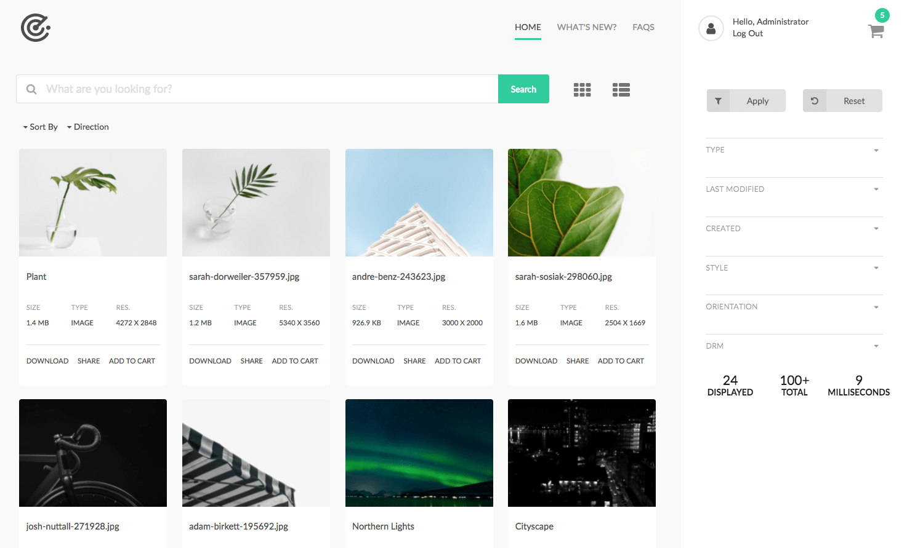
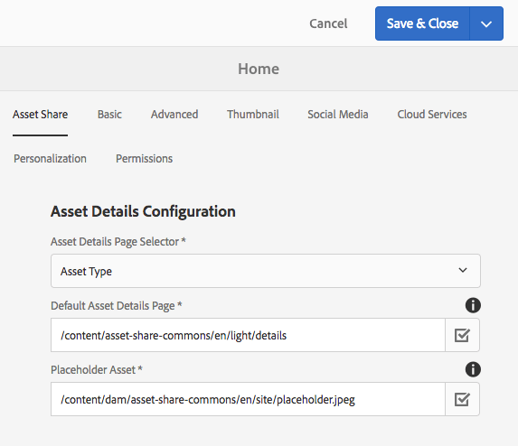
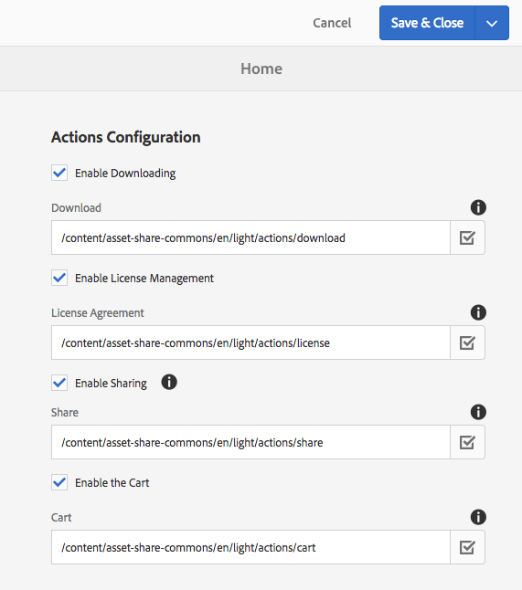
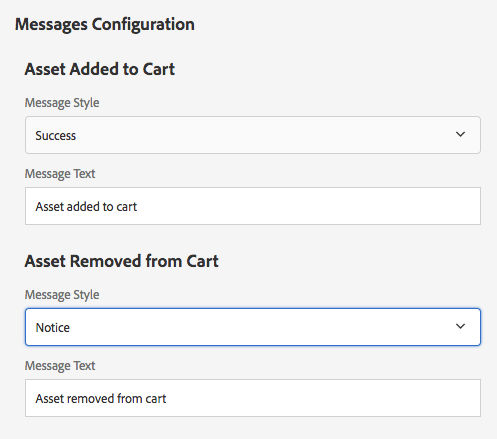

 
The search page is a special Template type that facilitates Search functionality via the Component in the `Asset Share Commons - Search` component group.

The minimum set of components to be added to the Search Page is the `Search Results` component. 

## Content Architecture

The Search Page acts as the "root configuration" for other Asset Share-related pages. 
Other Asset Share pages will look up the page tree for configurations that are applied at the Search Page level.
Search pages can be created under other search pages; for example, a "What's New" search page may exist under a "root" Search Page.

### Recommended Content Architecture

```
/content
     /site-root
           /search-page
                /details (default details page)
                     /image (details for images)
                     /video (details for videos)
                     /document  (details for word documents)
                     /presentation   (details for power point)
                /actions
                     /cart
                     /download
                     /share
                     /license
                /specific-search-page-1        
                /specific-search-page-2  
```


## Authoring

Search page authoring can be broken into 2 concerns:

* Configuring the Asset Search tree via the Search Page's Page Properties.
* Composing the search experience via components.


### Page Properties / Asset Share / Asset Share Details Configuration




#### Asset Details Page Selector

Defines how Asset Details pages should be resolved for this content tree.

  * Always use default Asset Details page
    * When selected the **Default Asset Details Page* (defined in the next field) will always be used.  
  * Asset Type
    * The "Asset Type" computed property is used to determine the name of the Asset Details pages to use. The asset details page to use for an asset will be `<default-asset-details-page>/<asset-type>`. If no Asset Type can be derived, then the Default Asset Details Page will be used.
    
#### Default Asset Details Page

The default asset details page.

#### Placeholder Asset

The default placeholder asset to use. 

This is only used to aid in the authoring of Asset Details pages (since in order to edit an Asset Details page effectively, some asset data must be present), and is never displayed to users.

Several placeholder assets provided by Asset Share Commons (`/apps/asset-share-commons/resources/placeholder.XXX`).


### Page Properties / Asset Share / Actions Configuration



##### Enable Downloading

Select to enable the downloading of assets. When disabled, "Download" buttons will not be displayed.

##### Enable License Management

Select to enable license management for assets. If this is enabled, the license modal will be displayed before a user can download or add to cart a licensed asset. 

##### Enable Sharing

Select to enable sharing. When disabled, "Share" buttons will not be displayed. The provided sharing implementation shares via e-mail and is dependent on ACS AEM Common 3.11.0+.

* Even if Enable Sharing is selected, sharing may be disabled if ACS AEM Commons is not installed and active. 

##### Enable Enable the Cart

Select to enable Cart functionality. When disabled, "Add to cart" buttons will not be displayed. 

  * Cart functionality is dependent on the provided ContextHub Cart implementation which must be set via `Page Properties > Personalization > ContextHub Path`.
    * The cart provided by Asset Share Commons  is located at `/etc/cloudsettings/asset-share-commons/contexthub` 


### Page Properties / Asset Share / Messages Configuration



Message configurations are used to define the style and text of message (or notifications). Currently there are only 2 types of messsages:

  * Asset Added to Cart
  * Assets Already Exists in Cart

Each message can have configured attributes:

  * Message Type
    * Determines the style/color of the message.
    * Options: 
        * Success
        * Info
        * Warn
        * Error      
  * Message Text
    The message to display.

## Technical details

* **Component**: `/apps/asset-share-commons/components/search/tags`
* **Sling Model**: `com.adobe.aem.commons.assetshare.search.predicates.impl.TagsPredicateImpl`

This filter implements a wrapped version of AEM Query Builder's [JcrPropertyPredicateEvaluator](https://docs.adobe.com/docs/en/aem/6-3/develop/ref/javadoc/com/day/cq/search/eval/JcrPropertyPredicateEvaluator.html). 
The Asset Share Commons' provided predicate wrapper (`com.adobe.aem.commons.assetshare.search.impl.predicateevaluators.PropertyValuesPredicateEvaluator`) allows for the values to be provided as comma-delimited values to be transformed into `#_value` parameters for evaluation by AEM's JcrPropertyPredicateEvaluator; 

Example generated Query Builder predicate output: 

```
1_group.propertyvalues.property=./jcr:content/metadata/cq:tags
1_group.propertyvalues.operation=equals
1_group.propertyvalues.1_values=we-retail:activity/surfing
1_group.propertyvalues.2_values=we-retail:activity/swimming
```      


